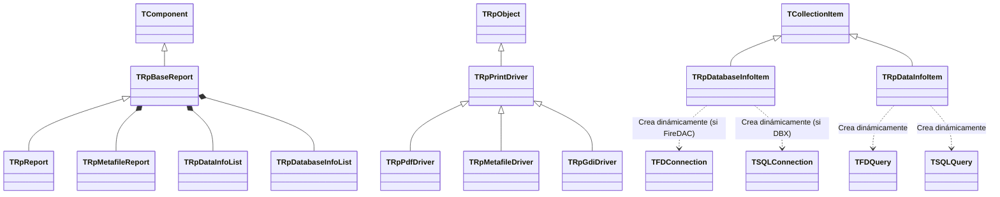

# Análisis Técnico: Arquitectura de Report Manager (Legacy Delphi/C++)

Este documento proporciona una descripción técnica detallada del funcionamiento interno del sistema de reportes "Report Manager", basada en el análisis del código fuente.

## 1. Visión General
Report Manager es un motor de reportes y una herramienta de diseño escrita principalmente en Delphi (Object Pascal), con algunos componentes en C++. Utiliza la biblioteca VCL (para Windows) y CLX (para compatibilidad multiplataforma/Linux con Kylix/Qt). El sistema está diseñado para ser agnóstico a la base de datos y al dispositivo de salida.

## 2. Motor de Renderizado de Informes

El proceso de carga y renderizado de un archivo de informe (`.rep`) es gestionado principalmente por las clases `TRpReport` y `TRpBaseReport`.

### Procesamiento de Archivos .rep
Los archivos `.rep` contienen la definición del informe. El sistema soporta varios formatos de almacenamiento, identificados por el primer byte del archivo (`TRpBaseReport.LoadFromStream` en `rpbasereport.pas`):
*   **Binario (DFM-like):** Formato nativo de streaming de componentes de Delphi.
*   **XML (`<`):** Procesado por `rpxmlstream.pas`.
*   **Texto (`o`):** Formato de texto de componentes Delphi.
*   **Comprimido (`x`):** ZLib (legado).

### Flujo de Renderizado
El núcleo del motor reside en `TRpReport` (`rpreport.pas`). El proceso de generación funciona de la siguiente manera:

1.  **Inicialización (`BeginPrint`)**: Se prepara el `TRpPrintDriver` (driver de salida) y se inicializa el `TRpMetafileReport` (canvas intermedio). Se evalúan los parámetros iniciales.
2.  **Bucle de Impresión (`PrintNextPage`)**:
    *   **Iteración de Datos (`NextRecord`)**: `TRpReport` itera sobre los datasets conectados. Detecta cambios de grupo para activar cabeceras/pies de grupo.
    *   **Selección de Secciones (`NextSection`)**: Determina qué sección (Header, Detail, Group Header/Footer) debe imprimirse a continuación basándose en el estado actual de los datos y la configuración del informe.
    *   **Motor de Layout (`CheckSpace`)**: Antes de imprimir una sección, verifica si hay espacio suficiente en la página actual. Si no, genera un salto de página.
    *   **Impresión (`PrintSection`)**: Dibuja los componentes de la sección (Labels, Shapes, Charts) en el `TRpMetafileReport`.
3.  **Metaarchivo (`TRpMetafileReport`)**: El resultado del renderizado no va directamente a la impresora o PDF. Se almacena en un metaarchivo propio (`rpmetafile.pas`), que contiene una lista de páginas y objetos gráficos (texto, líneas, imágenes). Esto permite funcionalidades como "Two Pass" (doble pasada) para calcular totales de páginas (`Page x of y`) antes de la salida final.

## 3. Capa de Abstracción de Datos (DAL)

La gestión de datos se encuentra centralizada en `rpdatainfo.pas`. El sistema implementa una capa de abstracción que permite cambiar de motor de base de datos sin modificar la lógica del informe.

### Clases Principales
*   **`TRpDatabaseInfoList` y `TRpDatabaseInfoItem`**: Representan las conexiones a bases de datos.
*   **`TRpDataInfoList` y `TRpDataInfoItem`**: Representan los conjuntos de datos (Queries, Tablas) dentro del informe.

### Gestión de Conexiones SQL
La clase `TRpDatabaseInfoItem` actúa como un wrapper para múltiples tecnologías de acceso a datos. La propiedad `Driver` (`TRpDbDriver`) determina qué componentes internos se instancian dinámicamente:

*   **Drivers Soportados**:
    *   `rpfiredac`: FireDAC (`TFDConnection`, `TFDQuery`).
    *   `rpdatadbexpress`: DBExpress (`TSQLConnection`, `TSQLQuery`).
    *   `rpdataibx`: InterBase Express (`TIBDatabase`, `TIBQuery`).
    *   `rpdataado`: ADO (`TADOConnection`, `TADOQuery`).
    *   `rpdatabde`: BDE (Legacy, `TDatabase`, `TQuery`).
    *   `rpdatazeos`: ZeosLib.

### Flujo de Conexión (`Connect`)
Cuando se activa un dataset (`TRpDataInfoItem.Connect`):
1.  Busca la conexión (`TRpDatabaseInfoItem`) asociada.
2.  Si la conexión interna no existe, la crea basándose en el tipo de `Driver`.
3.  Asigna la cadena de conexión y parámetros.
4.  Crea el componente de dataset interno correspondiente (ej. `TFDQuery`).
5.  **Sustitución de Parámetros**: Analiza la sentencia SQL y sustituye parámetros definidos en el informe antes de abrir la consulta.
6.  **Master-Detail**: Gestiona enlaces maestro-detalle mediante `TRpDataLink` y `DataSource`.

## 4. Flujo de Exportación

La exportación y visualización se desacoplan del renderizado mediante el uso de "Drivers de Impresión" (`TRpPrintDriver`) que consumen el `TRpMetafileReport`.

### PDF (`rppdfdriver.pas`)
*   **Clase**: `TRpPdfDriver`.
*   **Proceso**:
    *   Hereda de `TRpPrintDriver`.
    *   Itera sobre las páginas del `TRpMetafileReport`.
    *   Utiliza `TRpPDFFile` (`rppdffile.pas`) para generar el flujo de bytes del archivo PDF.
    *   Convierte las primitivas gráficas del metaarchivo (Textos, Líneas, Imágenes) a objetos PDF.
    *   Soporta compresión y normas PDF/A.

### Impresión y Drivers del Sistema (`rpgdidriver.pas` / `rpqtdriver.pas`)
*   Para la impresión física, se utiliza un driver que mapea las llamadas del metaarchivo a la API gráfica del sistema operativo (GDI en Windows, Qt en Linux).
*   `DoShowPrintDialog` (en `rpprintdia.pas` o `rpqtdriver.pas`) muestra el diálogo de impresión nativo.

### Vista Previa (`rppreview.pas`)
*   **Clase**: `TFRpPreview`.
*   **Funcionamiento**:
    *   Es un formulario (`TForm`) que incrusta un control visual `TRpPreviewMetaCLX`.
    *   Este control dibuja el `TRpMetafileReport` en pantalla.
    *   La barra de herramientas del preview permite invocar acciones de exportación (Guardar como PDF, HTML, etc.) llamando a los drivers correspondientes (ej. `SaveMetafileToPDF`).

## 5. Jerarquía de Clases Principal

### Resumen
*   **TRpReport**: Orquestador principal. Procesa lógica y datos.
*   **TRpMetafileReport**: Resultado gráfico intermedio.
*   **TRpPrintDriver**: Clase base para salidas (Impresora, PDF, etc.).
*   **TRpDatabaseInfoItem**: Abstracción de conexión DB.
